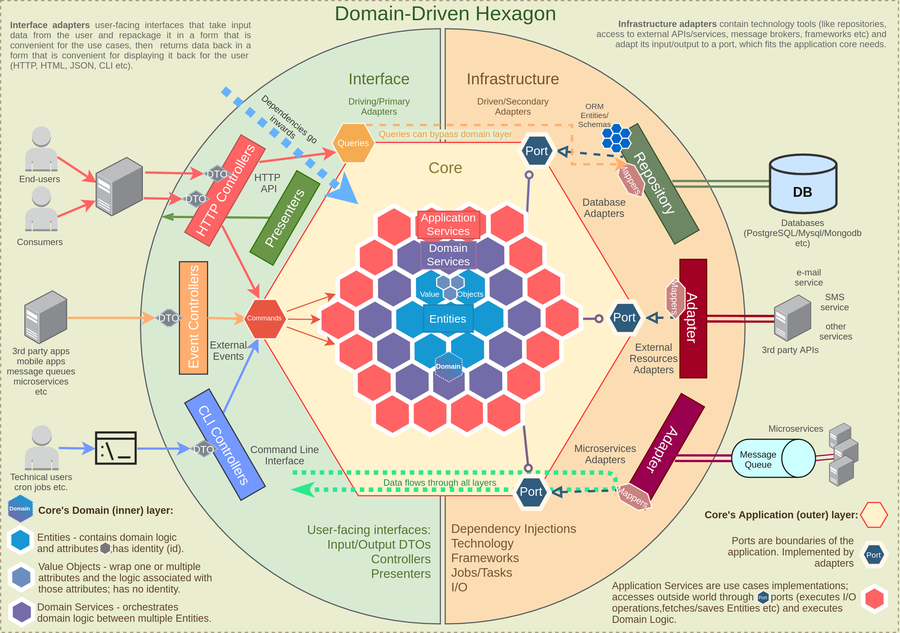

+ [Паттерны декомпозиции на микросервисы](#паттерны)
+ [Паттерны управления данными](#паттерны)
+ [Hexagonal architecture](#hexagonal-architecture)

## Паттерны декомпозиции на микросервисы

+ [1. Шаблон «Разбиение по бизнес-возможностям» (Decompose By Business Capability)]()
+ [2. Шаблон «Разбиение по поддоменам» (Domain-Driven Design, DDD)]()

### 1. Шаблон «Разбиение по бизнес-возможностям» (Decompose By Business Capability)
Суть в выделении главных бизнес-возможностей приложения и создать отдельный микросервис для каждой из них 
Бизнес-возможности - это функции, доступные пользователям при работе с приложением 
Например, такими возможностями могут быть "Управление заявкой на кредит", "Управление продуктами"

### 2. Шаблон «Разбиение по поддоменам» (Domain-Driven Design, DDD)
Вся предметная область (домен) разбивается на поддомены 
У каждого поддомена своя модель данных, ее область действия называется ограниченным контекстом 
Микросервисы разрабатываются внутри этих ограниченных контекстов 
Главная задача - правильно определить поддомены и границы между ними, там мы обеспечим максимальную независимость и избежим сильной связанности между сервисами

## END ---------------- Паттерны декомпозиции на микросервисы ----------------

## Паттерны управления данными

+ [1. Service Registry (Реестр сервисов)]()
+ [2. API Gateway (API-шлюз)]()
+ [3. Circuit Breaker (Предохранитель)]()
+ [4. Bulkhead (Отсек)]()
+ [5. Saga Pattern (Сага)]()
+ [6. Event Sourcing (Источник событий)]()
+ [7. Command Query Responsibility Segregation (CQRS, Разделение команд и запросов)]()
+ [8. Data Sharding (Шардинг данных)]()
+ [9. Polyglot Persistence (Многовариантное хранение)]()
+ [10. Retry (Повторная попытка)]()
+ [11. Sidecar (Вспомогательный сервис)]()
+ [12. Backends for Frontends (BFF, Бэкенды для фронтендов)]()
+ [13. Shadow Deployment (Теневое развертывание)]()
+ [14. Consumer-Driven Contracts (Контракты, определяемые потребителем)]()
+ [15. Smart Endpoints, Dumb Pipes (Умные конечные точки, глупые каналы)]()
+ [16. Database per Service (База данных для каждого сервиса)]()
+ [17. Async Messaging (Асинхронный обмен сообщениями)]()
+ [18. Stateless Services (Сервисы без состояния)]()

### 1. Service Registry (Реестр сервисов)
Решает проблему обнаружения сервисов в распределенной системе.  
Каждый микросервис регистрирует себя в центральном реестре. 
Когда одному сервису нужно взаимодействовать с другим, он обращается к реестру, чтобы узнать текущий адрес нужного сервиса. 
Это позволяет сервисам динамически обнаруживать друг друга без жесткой привязки к конкретным адресам

### 2. API Gateway (API-шлюз)
Действует как единая точка входа для всех клиенских запросов. 
Он принимает запросы от клиентов и перенаправляет их соотвествующим микросервисам 
Также может выполнять такие задачи, как аутентификация, авторизация и балансировка нагрузи

### 3. Circuit Breaker (Предохранитель)
Предотвращает каскадные сбои в системе 
Когда один сервис начинает давать сбои, Circuit Breaker временно блокирует запросы к этому сервису, предотвращая перегрузку и позволяя системе восстановиться

### 4. Bulkhead (Отсек)
Изолирует компоненты системы друг от друга, чтобы сбой в одной части не повлиял на другие 
Например, для разных сервисов могут использоваться отдельные пулы потоков и базы данных

### 5. Saga Pattern (Сага)
Используется для управления распределенными транзакциями в микросервисной архитектуре 
Длительная бизнес-операция разбивается на серию меньших, локальных транзакций 
Каждый сервис выполняет свою часть транзакции и публикует событие, которое запускает следующий шаг 
Если что-то идет не так, выполняются компенсирующие действия для отмены изменений 

Подходы к реализации Saga:
- `Оркестровка` = централизованная координация, при которой отдельный компонент (оркестратор) сообщает микросервисам, какие действия необходимо выполнить
- `Хореография` - это децентрализованная координация, при которой каждый микровервис "подслушивает" события или сообщения других микросервисов и решает, какие действия надо предпринять

### 6. Event Sourcing (Источник событий)
Вместо хранения только текущего состояния, этот паттерн сохраняет все события, которые привели к этому состоянию 
Обеспечивает надежный аудиторский след и позволяет восстановить состояние системы в любой момент времени

### 7. Command Query Responsibility Segregation (CQRS, Разделение команд и запросов)
Распределяет операции чтения и записи в приложении 
Используются разные модели для обновления информации (команды) и чтения информации (запросы) 
Позволяет оптимизировать каждую сторону независимо, что может значительно улучшить производительность и масштабируемость

### 8. Data Sharding (Шардинг данных)
Используется для распределения нагрузки на базу данных 
Данные разделяются на несколько баз данных или экземпляров базы данных 
Каждый микросервис может обрабатывать подмножество данных или определенные типы запросов 
Поможет избежать узких мест в работы с данными и улучшает масштабируемость

### 9. Polyglot Persistence (Многовариантное хранение)
Позволяет использовать разные технологии баз данных для разных микросервисов, исходя из их конкретных потребностей 
Например, один микросервис может использовать реляционную БД, другой NOSQL, третий графовую 
Это оптимизирует хранение, извлечение и обработку данных для каждого сервиса

### 10. Retry (Повторная попытка)
Обеспечивает повторение операции при возникновении временного сбоя - вместо немедленного отказа 
Может применяться на разных уровнях:
- от взаимодействий между сервисами
- до работы с базой данных 

Помогает справиться с кратковременными проблемами в сети или сервисах

### 11. Sidecar (Вспомогательный сервис)
Предполагает присоединение вспомогательного сервиса (sidecar) к основному микросервису для обеспечения дополнительной функциональности, такой как логирование, безопасность или коммуникация с внешними сервисами 
Позволяет основному сервису сосредоточиться на своей основной функции

### 12. Backends for Frontends (BFF, Бэкенды для фронтендов)
Создание отдельных бекенд-сервисов для каждого типа клиента (веб, мобильный и т.д.) 
Позволяет оптимизировать API под конкретные нужды каждого клиента, улучшая производительность и упрощая разработку клиенской части

### 13. Shadow Deployment (Теневое развертывание)
Отправка копии (тени) производственного трафика к новой версии микросервиса без влияния на реальный пользовательский опыт 
Это позволяет проверить производительность и корректность новой версии в реальных условиях, не подвергая риску текущих пользователей

### 14. Consumer-Driven Contracts (Контракты, определяемые потребителем)
Потребители сервисов определяют свои ожидания от поставщиков сервисов 
Это помогает обеспечить более надежные и согласованные изменения в системе 
Каждый сервис-потребитель описывает, какой именно функционал и в каком формате он ожидает от сервиса-поставщика

### 15. Smart Endpoints, Dumb Pipes (Умные конечные точки, глупые каналы)
Паттерн рекомендует размещать бизнес-логику в самих микросервисах (умные конечные точки), а не полагаться на сложное промежуточное ПО 
Инфраструктура коммуникаций (каналы) должна быть простой и заниматься только маршрутизацией сообщений

### 16. Database per Service (База данных для каждого сервиса)
Микросервис имеет собственную базу данных, и сервисы обращаются через четко определенные API 
Это обеспечивает изоляцию данных и независимость сервисов, но требует тщательного подхода к обеспечению согласованности данных между сервисами 
Физически микросервисы могу использовать одну и ту же базу данных, но в ней они должны работать с отдельными схемами, коллекциями или таблицами

### 17. Async Messaging (Асинхронный обмен сообщениями)
Предполагает использование очередей сообщений для асинхронной коммуникации 
Сервисы перестают блокировать системы в ожидании ответа

### 18. Stateless Services (Сервисы без состояния)
Каждый сервис обрабатывает запрос независимо, не полагаясь на сохраненное состояние - это облегчает горизонтальное масштабирование

## END ---------------- Паттерны ----------------

## Hexagonal architecture

+ [1. Принципы архитектуры]()

### 1. Принципы архитектуры

1. Основной домен - domain layer. Центральная часть приложения, отвечающая за реализацию внутренних правил и процессов
2. Порты - ports - интерфейсы, которые определяют способы взаимодействия бизнес-логики с внешними сервисами
    - Input
    - Output
3. Адаптеры - adapters - реализуют работу портов и помогаю преодолеть разрыв между логикой домена и любыми внешними сервисами
   - Primary - Используют input ports - Используют основную логику основного домена с помощью input ports
   - Secondary - Реализуются во внешних модулях 
4. Разделение концепций за счет разделения на разные слои. Бизнес-логика изолирована от внешних зависимостей, что позволяет сосредоточиться на основны задачах
5. Использования принципа Dependency Inversion и Polymorphism для обозначения правил зависимостей, чтобы достичь максимальной независимости и стабильности для domain layer
6. Не зависит от фреймворка, UI, бд и любых других внешних библиотек
7. Повышенная тестируемость

## END ---------------- Hexagonal architecture ----------------